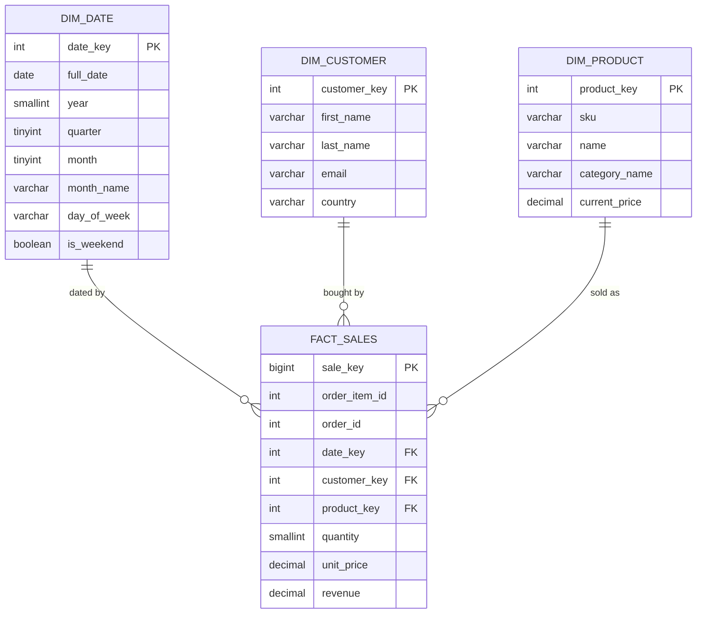

# 06 — ETL

This module builds a real (if small) ETL pipeline: `ecommerce` (the OLTP
database you've been querying) → `warehouse` (a star schema built for
analytics), using Python as the orchestrator and MySQL on both ends.

## Why OLTP and warehouse schemas differ

`ecommerce` is normalized for safe, fast single-row writes (place an order,
update a status) without duplication. That same shape is awkward for
analytics: "revenue by month by category" means joining five tables and
aggregating, every time, over the live transactional tables.

A **star schema** flips the trade-off: one wide `fact_sales` table (one row
per sale, pre-joined to the dimension keys) surrounded by small **dimension**
tables (`dim_date`, `dim_customer`, `dim_product`) that describe the "who,
what, when" in denormalized, query-friendly form. Analytical queries become
one join per dimension you care about, with no OLTP write traffic in the way.



## ETL, piece by piece

1. **Extract** — pull only what changed since the last run. `etl_pipeline.py`
   keeps a **watermark** (the highest `order_item_id` it has processed, not a
   timestamp) in `warehouse.etl_control`, so a re-run doesn't re-read the
   entire source table — this is an *incremental* load, the pattern real
   pipelines use once a source table is too big to fully re-scan every run.
   An ID-based watermark instead of a `DATETIME` one is deliberate: two rows
   landing in the same second could tie at the boundary of a timestamp
   watermark and one would be silently skipped; `order_item_id` is a unique,
   strictly increasing `AUTO_INCREMENT`, so there's no tie to lose.
2. **Transform** — reshape rows into the star schema, and apply business
   rules that belong in the pipeline, not the raw source query (here: drop
   `cancelled` orders — they were never a sale). Also computes derived
   values (`revenue = quantity * unit_price`) and date-dimension attributes
   (quarter, day-of-week, is_weekend) once, so every downstream query gets
   them for free instead of recomputing.
3. **Load** — `INSERT ... ON DUPLICATE KEY UPDATE` (MySQL's upsert) into
   each dimension and into `fact_sales`, keyed on natural keys
   (`customer_id`, `product_id`, `order_item_id`). This is what makes the
   script **idempotent** — running it twice on the same data changes
   nothing the second time, which matters because ETL jobs get retried after
   failures and you don't want duplicate facts when they do.

## Run it

```bash
# 1. Warehouse schema (once)
docker compose exec -T mysql mysql -u root -p"$MYSQL_ROOT_PASSWORD" < 06-etl/warehouse_schema.sql

# 2. Python deps
python3 -m venv .venv && source .venv/bin/activate
pip install -r 06-etl/requirements.txt

# 3. Run the pipeline
cd 06-etl && python etl_pipeline.py
```

Expected first run: it picks up every non-cancelled order line in the seed
data (watermark starts at 0). Run it again immediately — it should print
"nothing new to load", because the watermark now covers everything.

To see the incremental behavior for real, insert a fresh order into
`ecommerce` (via the `mysql` client or Adminer) — its `order_items` rows will
get new, higher `order_item_id`s automatically — then re-run the script:
only that new row gets pulled and loaded.

## Query the warehouse

Now the "revenue per month per category" query from 02-querying collapses to:

```sql
USE warehouse;

SELECT dd.year, dd.month_name, dp.category_name, SUM(fs.revenue) AS revenue
FROM fact_sales fs
JOIN dim_date dd ON dd.date_key = fs.date_key
JOIN dim_product dp ON dp.product_key = fs.product_key
GROUP BY dd.year, dd.month, dd.month_name, dp.category_name
ORDER BY dd.year, dd.month, revenue DESC;
```

No multi-table OLTP join, no re-deriving `quarter`/`day_of_week` — that work
already happened once, in the pipeline.

## Where this goes next (reading, not exercises)

- **Orchestration**: in production this script would be triggered by a
  scheduler (cron, Airflow, Dagster) instead of run by hand.
- **Slowly Changing Dimensions (SCD)**: `dim_customer`/`dim_product` here are
  "Type 1" — an update overwrites history (if a customer's country changes,
  old facts silently look like they always had the new country). "Type 2"
  keeps history by inserting a new dimension row with `valid_from`/
  `valid_to`/`is_current` instead of updating in place.
- **CDC (Change Data Capture)**: instead of polling with a watermark query,
  a production pipeline often reads MySQL's binlog directly (e.g. via
  Debezium) to catch every change, including deletes, with lower latency.
- **Batch vs. streaming**: this script is a batch job (run it, it processes
  what's new, it exits). A streaming pipeline would process each change as
  it happens instead.

## Exercise

Extend `etl_pipeline.py` to also populate a `dim_category` table (currently
`category_name` is flattened directly onto `dim_product` — a deliberate
simplification) and repoint `fact_sales`/queries at it. This is the
"denormalize vs. keep a dimension" trade-off in miniature.
