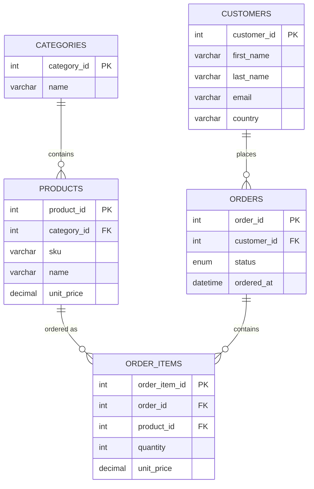

# MySQL Deep Dive

<p align="center">
  
  
  
  
</p>

A self-contained curriculum for studying MySQL, from basics through building a
real incremental ETL pipeline. Everything runs against a seeded, disposable
MySQL instance in Docker — no answer keys, just a live database to query.

## Repo Snapshot

- **7 modules**, `01-basics` through `07-administration`, each with a
  `README.md` (concepts) and an `exercises.sql` (practice against the live DB)
- **Seeded e-commerce dataset**: 5 categories, 20 products, 15 customers,
  55 orders, 67 order line items
- **A tested, idempotent ETL pipeline** (`06-etl/etl_pipeline.py`) loading the
  OLTP schema into a star-schema `warehouse`, with watermark-based
  incremental loading
- **Docker Compose** (MySQL 8 + Adminer) and **Cursor/VS Code** config
  (SQLTools connections, Python venv, ETL debug launch)
- **CI**: every push spins up MySQL, loads the schema + seed data, and runs
  the ETL pipeline end-to-end (including an idempotency check)

## Schema (`ecommerce`)



`06-etl` builds a second schema, `warehouse` (`fact_sales` +
`dim_date`/`dim_customer`/`dim_product`), fed from this one — see its README
for that diagram.

## Setup

Requires Docker.

```bash
cp .env.example .env
docker compose up -d
```

This starts:
- **MySQL 8** on `localhost:3308` (not 3306 — kept clear of a local MySQL
  install you may already have running on the default port), auto-initialized
  with `data/01_schema.sql` and `data/02_seed.sql` (an e-commerce OLTP schema:
  customers, products, categories, orders, order_items).
- **Adminer** (web GUI) on `http://localhost:8080` — server `mysql`, user
  `root`, password from `.env`.

Connect from a terminal (this goes through Docker's network directly, so it
still uses port 3306 *inside* the container):

```bash
docker compose exec mysql mysql -u root -p ecommerce
```

From the host (e.g. a GUI client, or the ETL script) use port **3308**.

Tear down (and wipe data) with `docker compose down -v`.

## Working in Cursor / VS Code

Open this folder as its own workspace (not the whole `Reaper` tree) so the
`.vscode/` config below applies:

- **`.vscode/extensions.json`** recommends SQLTools + its MySQL driver and the
  Python extension — accept the "install recommended extensions" prompt.
- **SQLTools** (`.vscode/settings.json`) is pre-configured with two
  connections, `ecommerce (docker)` and `warehouse (docker)`, both on
  `localhost:3308`. Open the SQLTools sidebar icon, connect, then open any
  `.sql` file (like an `exercises.sql`) — a "Run Query" codelens appears
  above each statement.
- **Python** — a project `.venv` is already created and has
  `06-etl/requirements.txt` installed; Cursor should pick it up automatically
  as the interpreter (`.vscode/settings.json` also pins it explicitly).
- **Run and Debug** panel has a **"Run ETL pipeline"** configuration that runs
  `06-etl/etl_pipeline.py` against the Docker containers with breakpoints
  available.

If you change `MYSQL_ROOT_PASSWORD` in `.env`, update the matching
`password` fields in `.vscode/settings.json` too — they're not linked.

## Modules

Each folder is a module with a `README.md` (concepts + examples) and often an
`exercises.sql` (do these against the running `ecommerce` database — write
your answers, then check them against the running server, not against an
answer key). Go in order; later modules assume earlier ones.

| Module | Topic |
|---|---|
| [01-basics](01-basics/README.md) | Setup, CRUD, data types |
| [02-querying](02-querying/README.md) | Joins, aggregation, subqueries, CTEs |
| [03-schema-design](03-schema-design/README.md) | Normalization, keys, constraints |
| [04-advanced](04-advanced/README.md) | Window functions, views, procs, triggers, transactions |
| [05-performance](05-performance/README.md) | EXPLAIN, indexing strategy, slow queries |
| [06-etl](06-etl/README.md) | Building a real extract-transform-load pipeline into a star-schema warehouse |
| [07-administration](07-administration/README.md) | Backup/restore, users & privileges |

## CI

`.github/workflows/sql-validation.yml` runs on every push: it starts a real
MySQL 8 service container, loads `data/01_schema.sql` and `data/02_seed.sql`,
loads `06-etl/warehouse_schema.sql`, runs the ETL pipeline, verifies
`warehouse.fact_sales` actually got populated, then runs the pipeline a
second time and asserts it's a no-op — a regression test for the
idempotency guarantee described in `06-etl/README.md`.

## License

[MIT](LICENSE)
